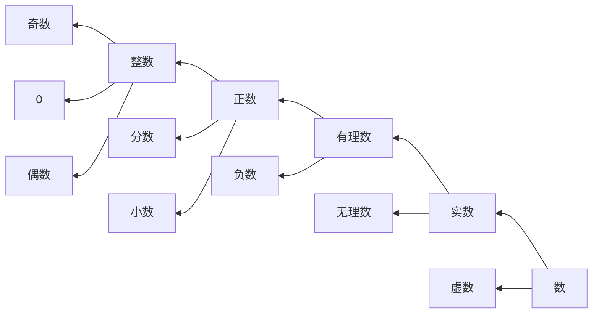

# Number

## 域

```mermaid
graph RL
        item[数]
        item0[整数]
        item1[分数]
        item2[小数]
        item3[奇数]
        item4[偶数]
        item5[正数]
        item6[负数]
        item7[0]
        item8[有理数]
        item9[无理数]
        item10[实数]
        item11[虚数]

        item0 --> item3
        item0 --> item7
        item0 --> item4

        item --> item10
        item --> item11
        item10 --> item8
        item10 --> item9
        item8 --> item5
        item8 --> item6
        item5 --> item0
        item5 --> item1
        item5 --> item2

        item11
```