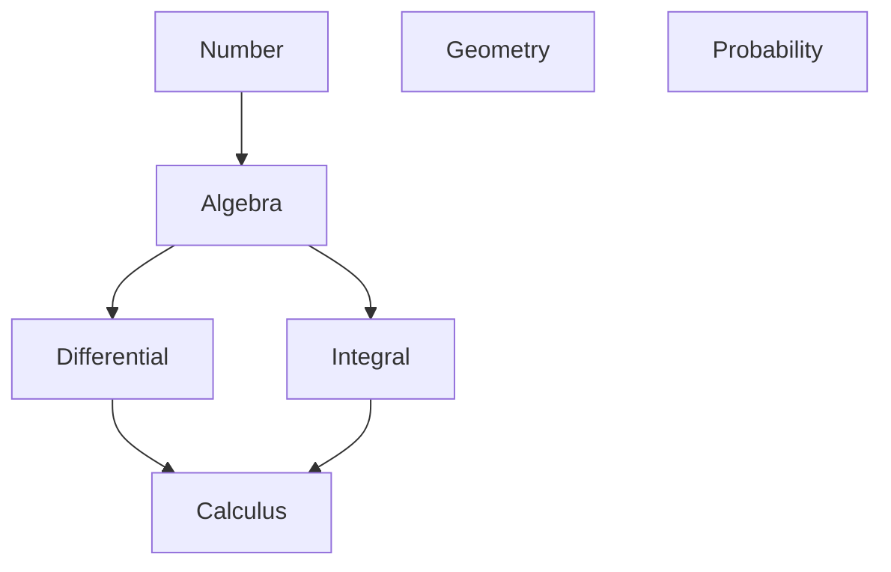

# Math

```mermaid
    graph TD
        A[Number]
        B[Algebra]
        C[Geometry]
        D[Calculus]
        D1[Differential]
        D2[Integral]
        E[Probability]

        A --> B
        D1 --> D
        D2 --> D
        B --> D1
        B --> D2
```